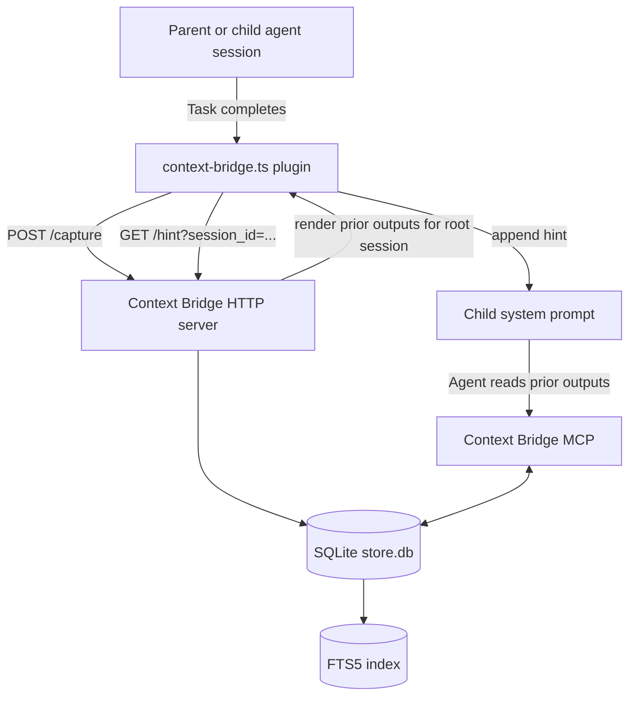

# context-bridge

A Go binary that captures subagent outputs from OpenCode sessions and exposes them via MCP tools and a terminal UI.

## Why context-bridge?

When working with OpenCode, subagents (grep, explore, executor, etc.) produce outputs that get lost after the session ends. context-bridge persists these outputs so you can:

- **Recover prior research** — avoid re-running expensive grep/explore calls
- **Reference past findings** — agents can read previous outputs via MCP tools
- **Browse offline** — TUI lets you inspect captured data without OpenCode running

## How it works



The plugin is a thin HTTP bridge (114 lines, no business logic). The Go binary owns all data persistence and query logic, resolving all captured data to the **root session** so child tasks can seamlessly access prior research.

## Prerequisites

| Requirement | Version | Notes |
|-------------|---------|-------|
| Go | 1.26+ | Build the binary |
| OpenCode | latest | The IDE agent |
| Bun | latest | Runtime for the TypeScript plugin |

Verify:

```bash
go version      # go1.26.x or later
bun --version   # any recent version
which opencode  # or wherever OpenCode is installed
```

## Installation

### Quick Install (recommended)

Install the latest release binary:

```bash
curl -sSL https://raw.githubusercontent.com/Andres77872/context-bridge/main/script/install.sh | bash
```

This fetches a **release binary** from GitHub Releases and installs it to `${XDG_BIN_HOME:-$HOME/.local/bin}`. Bash is required.

Verify:

```bash
context-bridge version
```

### Environment overrides

| Variable | Default | Purpose |
|----------|---------|---------|
| `VERSION` | `latest` | Pin to specific release, e.g. `v0.2.0` |
| `INSTALL_DIR` | `$HOME/.local/bin` | Override binary destination |
| `NO_CHECKSUM` | `0` | Set to `1` to skip checksum verification |

### Version comparison behavior

The installer compares the installed version with the target version:

- **Versions match** — skips install, exits cleanly
- **Versions differ** — installs the target version (including downgrades)

To install a specific version:

```bash
VERSION=v0.3.0 curl -sSL https://raw.githubusercontent.com/Andres77872/context-bridge/main/script/install.sh | bash
```

If you already have `v0.3.0` installed, the installer skips. If you have `v0.4.0` and request `v0.3.0`, it will downgrade.

### Build from source

```bash
cd /path/to/context-bridge
go install ./cmd/context-bridge
```

### Configure OpenCode

Add to `~/.config/opencode/opencode.json`:

```jsonc
{
  "mcp": {
    "context-bridge": {
      "enabled": true,
      "type": "local",
      "command": ["context-bridge", "mcp"]
    }
  },
  "permission": {
    "list": "allow",
    "read": "allow",
    "search": "allow"
  }
}
```

Restart OpenCode to load the MCP server.

### Configuration

The MCP server reads a configuration file at startup to determine search behavior.

#### Config location

| Source | Path |
|--------|------|
| **Default** | `<UserConfigDir>/context-bridge/config.json` (e.g., `~/.config/context-bridge/config.json` on Linux) |
| **Env override** | `$CONTEXT_BRIDGE_CONFIG` |

If the default config file doesn't exist, defaults are used. If `CONTEXT_BRIDGE_CONFIG` is set but the file doesn't exist, the server fails to start.

#### Config file format

```json
{
  "search_mode": "regex"
}
```

#### Search modes

| Mode | Query syntax | Description |
|------|--------------|-------------|
| `regex` (default) | Go regex | Case-insensitive regex. Invalid regex falls back to literal match. |
| `fts5` | SQLite FTS5 MATCH | Full-text search with words, quoted phrases, prefix wildcards (`term*`). |

#### MCP behavior

**Important**: The MCP tool descriptions and server instructions change based on the configured `search_mode`:

- **Docs** (this README) describe **both** modes so you understand all options.
- **MCP** (tool descriptions, prompts, hints) shows **only** the active configured mode.

When `search_mode: regex`, the MCP `search` tool describes regex syntax and examples. When `search_mode: fts5`, it describes FTS5 MATCH syntax instead.

This means agents using Context Bridge receive guidance specific to the active mode — they don't need to guess or read generic docs.

#### Mode-specific guidance

**Regex mode** (default):

- Use Go regex syntax: `auth.*`, `error.*Handler`, `(?i)jwt`
- Invalid regex automatically falls back to case-insensitive literal match
- Results appear in capture order (no ranking)

**FTS5 mode**:

- Use words and quoted phrases: `"exact phrase"`, `token*` (prefix), `content:term` (column filter)
- FTS5 operators: AND (implicit), OR (`term1 OR term2`), NOT (`term1 NOT term2`)
- Results ranked by BM25 score

### 4. Verify everything works

```bash
# Binary works
context-bridge version

# TUI opens
context-bridge tui

# MCP server starts (press Ctrl+D to exit stdio mode)
echo '{"jsonrpc":"2.0","id":1,"method":"initialize","params":{"protocolVersion":"2024-11-05","capabilities":{}}}' | context-bridge mcp
```

## Commands

### `context-bridge serve`

Starts the HTTP server that the TypeScript plugin talks to.

```bash
context-bridge serve
context-bridge serve --addr 127.0.0.1:7438
```

**Environment variables:**

| Variable | Default | Description |
|----------|---------|-------------|
| `CONTEXT_BRIDGE_ADDR` | `127.0.0.1:7438` | HTTP listen address |
| `CONTEXT_BRIDGE_PORT` | `7438` | Port (if ADDR not set) |
| `CONTEXT_BRIDGE_DB` | `~/.local/share/context-bridge/store.db` | SQLite database path |

**Note:** You rarely run this manually. The plugin auto-spawns it when needed.

### `context-bridge mcp`

Starts the MCP stdio server for agent-facing tools. OpenCode manages this automatically via the `mcp` config block.

```bash
context-bridge mcp
```

### `context-bridge tui`

Opens an interactive terminal browser for captured outputs.

```bash
context-bridge tui
```

### `context-bridge web`

Starts a web dashboard for browsing captured outputs.

```bash
context-bridge web
context-bridge web --addr 127.0.0.1:7440
```

**Environment variables:**

| Variable | Default | Description |
|----------|---------|-------------|
| `CONTEXT_BRIDGE_WEB_ADDR` | `127.0.0.1:7440` | Web dashboard listen address |

### `context-bridge version`

Prints the binary version.

```bash
context-bridge version
```

## MCP Tools

### `list`

Lists all captured outputs for a session with sequence numbers, timestamps, sizes, and previews.

**Parameters:**

| Name | Type | Required | Description |
|------|------|----------|-------------|
| `session_id` | string | yes* | OpenCode session ID |
| `agent` | string | no | Filter by agent type (e.g., `grep`, `explore`) |

*Required for MCP usage; the plugin auto-injects this.

**Example:**

```json
{
  "session_id": "ses_abc123",
  "agent": "grep"
}
```

**Output:**

```markdown
## Session Context — 5 subagent outputs
Root session: `ses_abc123`

| # | Agent | Task | Time | Size |
|---|-------|------|------|------|
| 1 | grep | Investigate auth module | 2m ago | 12KB |
| 2 | explore | Check plugin boundary | 5m ago | 8KB |
...

### Previews

**[#1] grep** — Investigate auth module
> ## auth module investigation
> Found 3 files implementing authentication...

Use `read` with `session_id="ses_abc123"` and `output=<number>` to read one output.
```

### `read`

Reads the full content of a specific output by its sequence number.

**Parameters:**

| Name | Type | Required | Description |
|------|------|----------|-------------|
| `session_id` | string | yes | OpenCode session ID |
| `output` | number | yes | Output number from the list |

**Example:**

```json
{
  "session_id": "ses_abc123",
  "output": 1
}
```

**Output:**

```markdown
## Output #1: [grep] Investigate auth module
**Time**: 2026-03-22T14:30:00Z | **Size**: 12KB

---

## auth module investigation

### Files Found
...
```

### `search`

Search across all captured outputs for a session. Query syntax depends on the configured `search_mode` (see [Configuration](#configuration)).

**Parameters:**

| Name | Type | Required | Description |
|------|------|----------|-------------|
| `session_id` | string | yes | OpenCode session ID |
| `query` | string | yes | Search query (syntax depends on configured mode) |
| `context_lines` | number | no | Lines of context around matches (default: 3) |

**Query syntax by mode:**

| Mode | Query syntax | Examples |
|------|--------------|----------|
| `regex` | Go regex (case-insensitive) | `auth.*`, `error.*Handler`, `(?i)jwt` |
| `fts5` | FTS5 MATCH | `"exact phrase"`, `token*`, `term1 OR term2` |

**Example (regex mode):**

```json
{
  "session_id": "ses_abc123",
  "query": "authentication.*JWT",
  "context_lines": 5
}
```

**Example (fts5 mode):**

```json
{
  "session_id": "ses_abc123",
  "query": "\"authentication\" JWT",
  "context_lines": 5
}
```

**Output:**

```markdown
## Search: "authentication JWT"

3 match(es) across 2 outputs.
Use `read` with `session_id="ses_abc123"` and the output # to read full content.

### #1 [grep] Investigate auth module
1 match(es)

...authentication logic uses JWT tokens...
     ^^match^^
...verify the JWT signature before...
```

## TUI Browser

Launch with `context-bridge tui`. A terminal interface for browsing captured outputs.

### Tabs

The TUI has 3 tabs:

| Tab | Content |
|-----|---------|
| **Overview** | Stats card + welcome screen |
| **Sessions** | Sessions list + captures + capture detail |
| **Search** | Search input + results |

### Key Bindings

| Key | Action |
|-----|--------|
| `j` / `↓` | Move down |
| `k` / `↑` | Move up |
| `enter` | Select / open |
| `tab` / `1` / `2` | Switch tabs |
| `/` | Filter mode (in sessions/captures list) |
| `s` | Search in current session |
| `p` | Settings (search mode: regex/fts5) |
| `i` | Install plugin (Overview tab) |
| `x` | Delete selected session/capture (with confirmation) |
| `y` | Confirm delete |
| `n` | Cancel delete |
| `esc` | Back / cancel |
| `q` | Back or quit |
| `ctrl+c` | Quit |
| `pgup`/`pgdn` | Page scroll (in capture detail) |
| `home`/`end` | Scroll to top/bottom (in capture detail) |

### Filter Mode (sessions/captures list)

Press `/` to activate inline filtering. Type to filter the output list client-side. Press `esc` or `enter` to exit filter mode.

### Scroll Indicators

When content exceeds the visible window, a footer shows: `showing 1–10 of 45`.

## Plugin Behavior

The plugin at `~/.config/opencode/plugins/context-bridge.ts` is intentionally thin:

**What it does:**
- Forwards OpenCode lifecycle hooks to the Go HTTP server
- Auto-spawns `context-bridge serve` if the server isn't running
- Returns silently (graceful degradation) if the backend is unavailable

**What it does NOT do:**
- No database access
- No search logic
- No data transformation
- No state management

### Hooks

| Hook | Purpose |
|------|---------|
| `session.created` | Register new session in store |
| `session.deleted` | Mark session as deleted (soft delete) |
| `tool.execute.after` | Capture Task tool outputs from subagents |
| `experimental.chat.system.transform` | Inject hint about prior outputs into system prompt |

### Auto-spawn behavior

When the plugin initializes or receives a hook, it:

1. Checks `http://127.0.0.1:7438/health` with 400ms timeout
2. If unreachable, spawns `context-bridge serve` via `Bun.spawn()`
3. Waits 600ms for startup
4. Proceeds with the HTTP call

If spawn fails or the server remains unreachable, the plugin continues silently — no error bubbles up to OpenCode.

### Environment variables (plugin)

| Variable | Default | Description |
|----------|---------|-------------|
| `CONTEXT_BRIDGE_PORT` | `7438` | HTTP port |
| `CONTEXT_BRIDGE_ADDR` | `127.0.0.1:7438` | Full address (overrides PORT) |
| `CONTEXT_BRIDGE_BIN` | `context-bridge` | Path to binary |

## Troubleshooting

### "No sessions captured yet"

The TUI shows this when the database is empty. Make sure:

1. OpenCode is running with the plugin configured
2. You've run tasks that invoke subagents (grep, explore, executor)
3. The plugin can reach the HTTP server

Check the server:

```bash
curl http://127.0.0.1:7438/health
# should return "OK"
```

### Plugin not loading

1. Verify the file exists: `ls ~/.config/opencode/plugins/context-bridge.ts`
2. Check OpenCode logs for plugin errors
3. Ensure Bun is installed: `bun --version`

### MCP server not starting

1. Verify binary is on PATH: `which context-bridge`
2. Test manually: `echo '{"jsonrpc":"2.0","id":1,"method":"initialize","params":{"protocolVersion":"2024-11-05","capabilities":{}}}' | context-bridge mcp`
3. Check OpenCode's MCP logs

### Database permission errors

The database lives at `~/.local/share/context-bridge/store.db`. Ensure the directory exists and is writable:

```bash
mkdir -p ~/.local/share/context-bridge
ls -la ~/.local/share/context-bridge/
```

### Port already in use

If port 7438 is taken, set a different port:

```bash
export CONTEXT_BRIDGE_PORT=7439
# Or in opencode.json, set CONTEXT_BRIDGE_PORT via plugin env
```

### Search returns no results

The search uses standard regular expressions. Try:
- Using `(?i)` prefix for case-insensitive matching
- Simpler queries without special regex characters
- OR syntax: `term1|term2`
- Prefix matching: `auth.*`

## Architecture

For deep technical details, see [DESIGN.md](./DESIGN.md).

Key components:

| Component | File | Responsibility |
|-----------|------|----------------|
| Store | `internal/store/store.go` | SQLite schema, queries, FTS |
| MCP | `internal/mcp/mcp.go` | Tool definitions, stdio server |
| TUI | `internal/tui/*.go` | Bubble Tea terminal browser |
| Web | `internal/web/web.go` | Web dashboard + API |
| HTTP | `internal/server/server.go` | Plugin-to-binary bridge |
| Config | `internal/config/config.go` | Configuration loading, search mode |
| Plugin | `plugin/opencode/context-bridge.ts` | OpenCode hooks, auto-spawn |

## Limitations

- **No cross-session search** — Search is scoped to one session tree
- **No purge/retention** — Data is retained forever (no TTL)

## Related Projects

- **[Engram](https://github.com/anomalyco/engram)** — Persistent memory system with `mem_*` tools, topics, and cross-session recall.
- **OpenCode** — The IDE agent framework this integrates with.

### Context Bridge vs. Engram

| Aspect | Context Bridge | Engram |
| --- | --- | --- |
| **Lifetime** | Same session tree only | Persistent across sessions |
| **Primary content** | Raw-ish subagent outputs | Curated observations / summaries |
| **Trigger** | Automatic on Task completion | Explicit `mem_save` / `mem_session_summary` |
| **Scope** | Root session descendants | Global DB with project/scope filtering |
| **Typical question**| "What did the grep task find 10 minutes ago?" | "How did we solve this class of problem last month?" |
